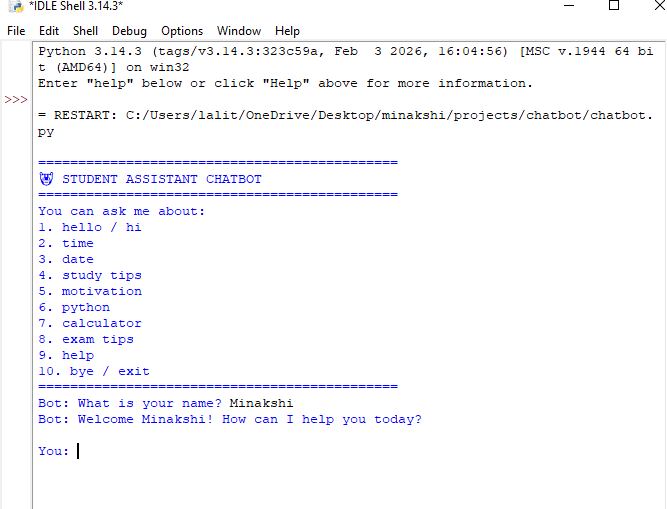
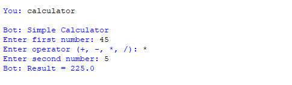
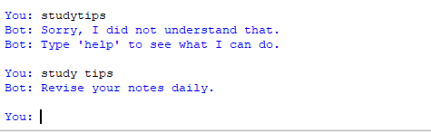
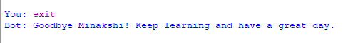

# 🤖 Student Assistant Chatbot

A simple **rule-based Student Assistant Chatbot** developed in **Python** as part of the **CodeAlpha Python Programming Internship**.

The chatbot helps students by providing study tips, motivational quotes, Python information, exam preparation tips, date, time, and a basic calculator through an interactive command-line interface.

---

## 📌 Features

- 👋 Friendly greeting
- 📅 Display current date
- 🕒 Display current time
- 📚 Study tips
- 💡 Motivational quotes
- 🐍 Python programming information
- 🧮 Simple calculator
- 📝 Exam preparation tips
- 📋 Help menu
- 🚪 Exit command
- ❌ Handles invalid input gracefully

---

## 🛠️ Technologies Used

- Python 3
- Built-in Python Modules
  - `datetime`
  - `random`

---

## 📂 Project Structure

```
CodeAlpha_BasicChatbot/
│
├── chatbot.py
├── README.md
├── LICENSE
└── screenshots/
    ├── home.png
    ├── calculator.png
    ├── studytips.png
    └── exit.png
```

---

## ▶️ How to Run

### 1. Clone the repository

```bash
git clone https://github.com/minakshi3097sharma-cloud/CodeAlpha_BasicChatbot.git
```

### 2. Navigate to the project folder

```bash
cd CodeAlpha_BasicChatbot
```

### 3. Run the chatbot

```bash
python chatbot.py
```

---

## 💬 Available Commands

| Command | Description |
|----------|-------------|
| hello | Greets the user |
| hi | Greets the user |
| time | Shows current time |
| date | Shows current date |
| study tips | Displays study tips |
| motivation | Shows motivational quotes |
| python | Provides Python information |
| calculator | Opens the calculator |
| exam tips | Displays exam preparation tips |
| help | Shows available commands |
| bye | Exits the chatbot |

---

## 📸 Screenshots

### Home Screen



### Calculator



### Study Tips



### Exit



---

## 🎯 Learning Objectives

This project demonstrates the use of:

- Functions
- Conditional Statements (`if-elif-else`)
- Loops (`while`)
- User Input
- String Handling
- Random Module
- Date and Time Module
- Exception Handling
- Basic Python Programming Concepts

---

## 🚀 Future Improvements

- Add login system
- Store chat history
- Voice interaction
- GUI using Tkinter
- AI-powered responses
- More educational resources
- Quiz feature
- Subject-wise study materials

---

## 📜 License

This project is licensed under the MIT License.

---

## 👩‍💻 Author

**Minakshi Sharma**

BCA Student | Python Learner

GitHub: https://github.com/minakshi3097sharma-cloud

LinkedIn: https://www.linkedin.com/in/minakshi-sharma-1a4969300

---

### ⭐ If you found this project helpful, consider giving it a Star on GitHub!
